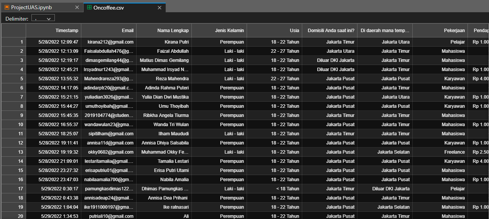

# Analysis-of-the-prototype-website-on-coffee

*by Mohammad Attala Rajafar*

Analysis of interest in the website on coffee. Nowadays all kinds of information about a place are very easy to get, just by using a laptop or smartphone and pressing a few buttons on a website or application, we can already find out the information we need. Especially with the pandemic situation that has gradually gone down, everyone wants to be able to socialize like normal circumstances, and usually the most sought-after gathering place is the cafe. Therefore we want to take advantage of technology so that it can be one of the innovations and solutions for the need to gather with the closest/loved people directly (offline), we built the Website On - Coffee system as our new product development.

Here's a quick look at the dataset I'm using:

  

The libraries used are as follows:
- numpy
- pandas
- matplotlib
- seaborn
